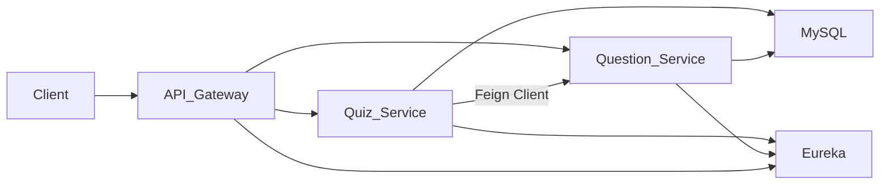

# Microservices Quiz & Question System

A **Spring Boot Microservices project** that demonstrates service discovery, API gateway routing, load balancing, and inter-service communication using **OpenFeign**.

The system contains two main services:

- **Quiz Service**
- **Question Service**

The **Quiz Service communicates with the Question Service via Feign Client** to retrieve questions for a particular quiz.

---

## Architecture Overview

## Microservices Components

### API Gateway
- Single entry point for client requests
- Routes requests to appropriate services
- Reduces direct communication between client and services

### Service Registry (Eureka Server)
- Handles **service discovery**
- Services register themselves with Eureka
- Enables **dynamic service lookup**

### Quiz Service
- Manages quiz related operations
- Communicates with Question Service using **Feign Client**
- Supports **multiple instances for load balancing**

### Question Service
- Manages question related operations
- Stores and retrieves question data

---

## Tech Stack

| Technology | Purpose |
|-----------|--------|
| Java | Core programming language |
| Spring Boot | Microservice framework |
| Spring Cloud | Distributed system tools |
| Eureka Server | Service discovery |
| OpenFeign | Inter-service communication |
| Spring Cloud Gateway | API Gateway |
| MySQL | Database |
| Maven | Build tool |

---

## Load Balancing

Multiple **Quiz Service instances** can run simultaneously.

If one instance fails or becomes overloaded:

- Another instance automatically handles the request
- Requests are distributed using **client-side load balancing**

This improves:

- Availability
- Fault tolerance
- Scalability

---

# Service Communication

Quiz Service communicates with Question Service using **Feign Client**.

Example:

Quiz Service → Feign Client → Question Service

This enables **clean and declarative REST calls between microservices**.

---

## How to Run the Project

Start the services in the following order:

### 1️⃣ Start Service Registry

service-registry

### 2️⃣ Start API Gateway

api-gateway

### 3️⃣ Start Question Service

question-service

### 4️⃣ Start Quiz Service

quiz-service

---

## Example Request Flow

Client Request
↓
API Gateway
↓
Quiz Service
↓
Feign Client
↓
Question Service
↓
Database

---

## Key Concepts Demonstrated

- Microservices architecture
- API Gateway pattern
- Service discovery with Eureka
- Inter-service communication using Feign
- Load balancing with multiple service instances
- MySQL database integration

---

## Repository

GitHub Repository  
https://github.com/GauravRanaOP/microservices-quiz-question-services

---

## Author

**Gaurav Rana**
